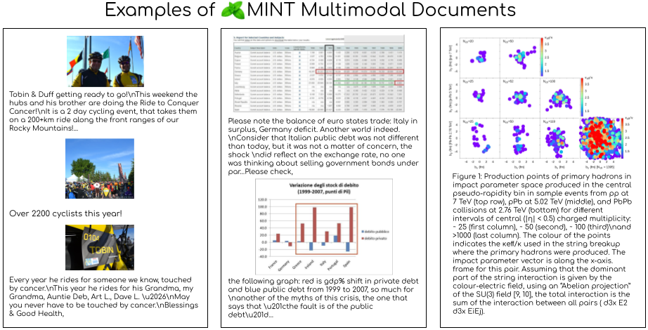

<h1 align="center">
   MINT-1T:<br>Scaling Open-Source Multimodal Data by 10x:<br> A Multimodal Dataset with One Trillion Tokens
</h1>

[Paper](https://arxiv.org/abs/2406.11271) | [Dataset](https://huggingface.co/collections/mlfoundations/mint-1t-6690216ca4d0df7e518dde1c) | [Blog Post](https://blog.salesforceairesearch.com/mint-1t/)



🍃 MINT-1T is an open-source **M**ultimodal **INT**erleaved dataset with one trillion text tokens and 3.4 billion images, a ~10x scale-up from existing open-source datasets. Additionally, we include previously untapped sources such as PDFs and ArXiv papers.

We release all subsets of MINT-1T, including:
- 🌐 [**HTML** Data](https://huggingface.co/datasets/mlfoundations/MINT-1T-HTML)
- 📚 **PDF** Data
  - We provide shards of MINT-1T PDFs for each CommonCrawl snapshot:
    - [CommonCrawl 2024-18](https://huggingface.co/datasets/mlfoundations/MINT-1T-PDF-CC-2024-18)
    - [CommonCrawl 2024-10](https://huggingface.co/datasets/mlfoundations/MINT-1T-PDF-CC-2024-10)
    - [CommonCrawl 2023-50](https://huggingface.co/datasets/mlfoundations/MINT-1T-PDF-CC-2023-50)
    - [CommonCrawl 2023-40](https://huggingface.co/datasets/mlfoundations/MINT-1T-PDF-CC-2023-40)
    - [CommonCrawl 2023-23](https://huggingface.co/datasets/mlfoundations/MINT-1T-PDF-CC-2023-23)
    - [CommonCrawl 2023-14](https://huggingface.co/datasets/mlfoundations/MINT-1T-PDF-CC-2023-14)
    - [CommonCrawl 2023-06](https://huggingface.co/datasets/mlfoundations/MINT-1T-PDF-CC-2023-06)
- 🔬 [**ArXiv** Data](https://huggingface.co/datasets/mlfoundations/MINT-1T-ArXiv)

## Updates
- [7/24] 🎉 We open-sourced the [🍃 MINT-1T dataset](https://huggingface.co/collections/mlfoundations/mint-1t-6690216ca4d0df7e518dde1c)!
- [6/17] We released our [technical report](https://arxiv.org/abs/2406.11271).

## Citation

If you found our work useful, please consider citing:
```
@article{awadalla2024mint1t,
      title={MINT-1T: Scaling Open-Source Multimodal Data by 10x: A Multimodal Dataset with One Trillion Tokens}, 
      author={Anas Awadalla and Le Xue and Oscar Lo and Manli Shu and Hannah Lee and Etash Kumar Guha and Matt Jordan and Sheng Shen and Mohamed Awadalla and Silvio Savarese and Caiming Xiong and Ran Xu and Yejin Choi and Ludwig Schmidt},
      year={2024}
}
```
